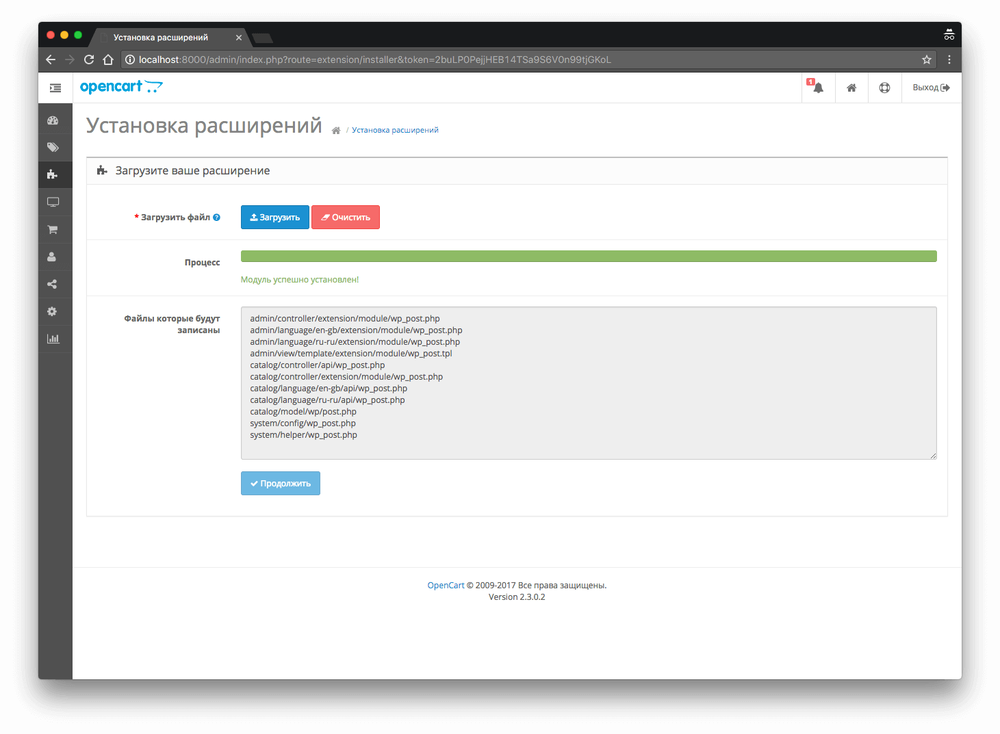
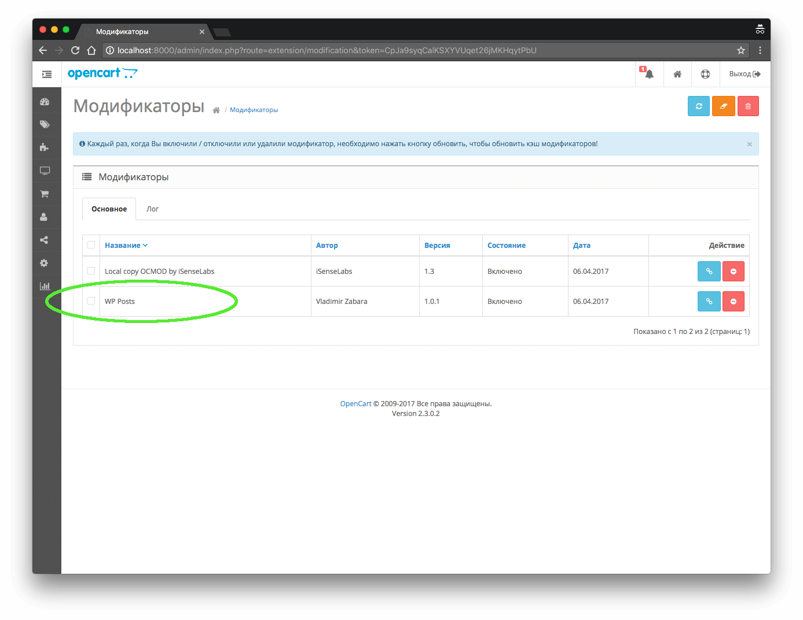
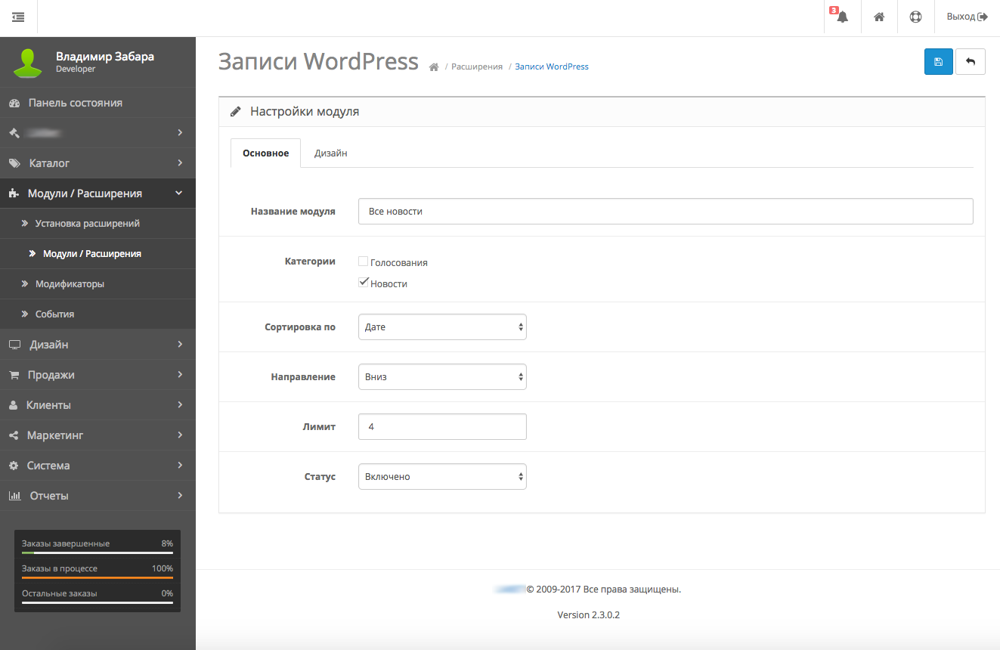
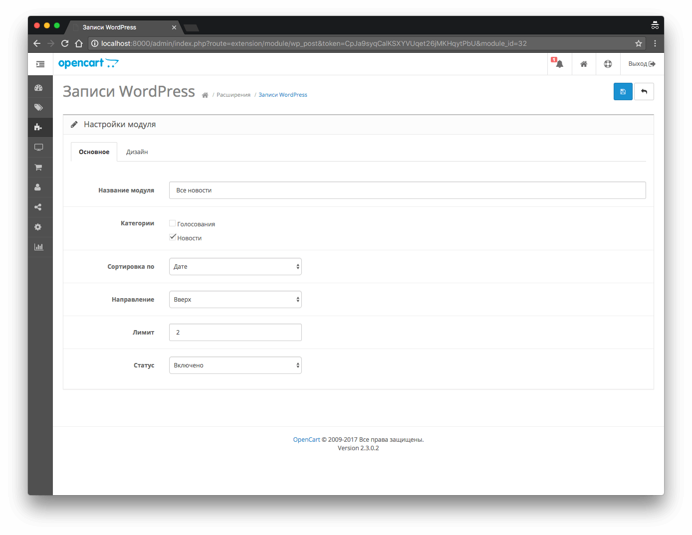
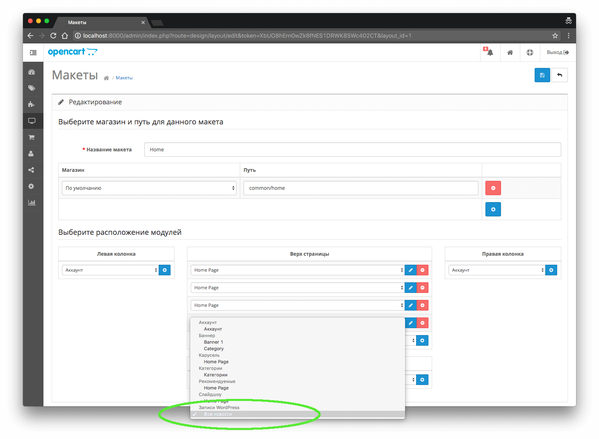
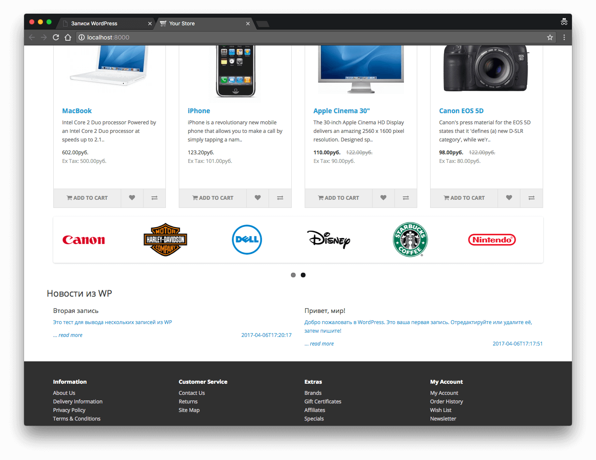

## Интеграция OpenCart 2.3 и WP 4.7

Модуль использует **WP REST API v2** для получения записей и отображения их в ленте новостей **OpenCart 2.3.x**.
При использовании совместно с **WP** плагином **Post To OpenCart** возможно получать посты непосредственно из **WP**
и сохранять их локально для дальнейшей обработки/показа (смотри https://github.com/wlady/wp-post-to-opencart).

После установки указать правильный адрес **WP** в файле _system/config/wp_post.php_.

Я использовал шаблоны **Twig** для генерации ленты новостей. Пример шаблона для модуля **Все новости**:
```
<div class="row">
    <h3>Новости из WP</h3>
    
            <div class="col-sm-6">
                    <a href="{{ post.link }}" class="blognews-item" target="_blank">
                        
                        <span class="blognews-info">
                        <h4 class="blognews-title text-overflow">{{ post.title.rendered | raw }}</h3>
                        <span class="blognews-text">{{ post.excerpt.rendered | raw }}
                            <span class="blognews-more">... <i>read more</i></span>
                        </span>
                        <span class="blognews-detail">
                            <span class="blognews-date pull-right">{{ post.date }}</span>
                        </span>
                    </span>
                </a>
            </div>
    
</div>
```


Для использования **Twig** в **OpenCart 2.3** достаточно установить необходимые пакеты с помощью _composer_:

```sh
composer require twig/twig --prefer-dist
```














